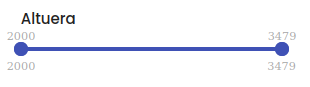
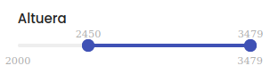
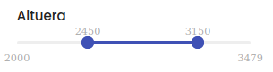

# volto-doublerange-facet

[](https://github.com/eea/volto-doublerange-facet/releases)

[](https://ci.eionet.europa.eu/view/Github/job/volto-addons/job/volto-doublerange-facet/job/master/display/redirect)
[](https://sonarqube.eea.europa.eu/dashboard?id=volto-doublerange-facet-master)
[](https://sonarqube.eea.europa.eu/dashboard?id=volto-doublerange-facet-master)
[](https://sonarqube.eea.europa.eu/dashboard?id=volto-doublerange-facet-master)
[](https://sonarqube.eea.europa.eu/dashboard?id=volto-doublerange-facet-master)

[](https://ci.eionet.europa.eu/view/Github/job/volto-addons/job/volto-doublerange-facet/job/develop/display/redirect)
[](https://sonarqube.eea.europa.eu/dashboard?id=volto-doublerange-facet-develop)
[](https://sonarqube.eea.europa.eu/dashboard?id=volto-doublerange-facet-develop)
[](https://sonarqube.eea.europa.eu/dashboard?id=volto-doublerange-facet-develop)
[](https://sonarqube.eea.europa.eu/dashboard?id=volto-doublerange-facet-develop)

[Volto](https://github.com/plone/volto) add-on

## Features

This addon let's you configure a double range facet in the Volto Search Block.

This allows you to build a year range selector for instance.

This facet requires to have the value indexed as a `FieldIndex` in the Plone backend.

At this moment the values need to be indexes as strings in the Plone backend. We will be working on supporting also values indexed as ints in the backend.

When configuring the facet, it allows to define the step in which the range will be moved up and down and it automatically detects the lower and highest values of the range.

## Images







## Getting started

### Try volto-doublerange-facet with Docker

      git clone https://github.com/eea/volto-doublerange-facet.git
      cd volto-doublerange-facet
      make
      make start

Go to http://localhost:3000

### Add volto-doublerange-facet to your Volto project

1. Make sure you have a [Plone backend](https://plone.org/download) up-and-running at http://localhost:8080/Plone

   ```Bash
   docker compose up backend
   ```

1. Start Volto frontend

- If you already have a volto project, just update `package.json`:

  ```JSON
  "addons": [
      "@eeacms/volto-doublerange-facet"
  ],

  "dependencies": {
      "@eeacms/volto-doublerange-facet": "*"
  }
  ```

- If not, create one:

  ```
  npm install -g yo @plone/generator-volto
  yo @plone/volto my-volto-project --canary --addon @eeacms/volto-doublerange-facet
  cd my-volto-project
  ```

1. Install new add-ons and restart Volto:

   ```
   yarn
   yarn start
   ```

1. Go to http://localhost:3000

1. Happy editing!

## Release

See [RELEASE.md](https://github.com/eea/volto-doublerange-facet/blob/master/RELEASE.md).

## How to contribute

See [DEVELOP.md](https://github.com/eea/volto-doublerange-facet/blob/master/DEVELOP.md).

## Copyright and license

The Initial Owner of the Original Code is European Environment Agency (EEA).
All Rights Reserved.

See [LICENSE.md](https://github.com/eea/volto-doublerange-facet/blob/master/LICENSE.md) for details.

## Funding

[European Environment Agency (EU)](http://eea.europa.eu)
ter/LICENSE.md) for details.

## Funding

[European Environment Agency (EU)](http://eea.europa.eu)
